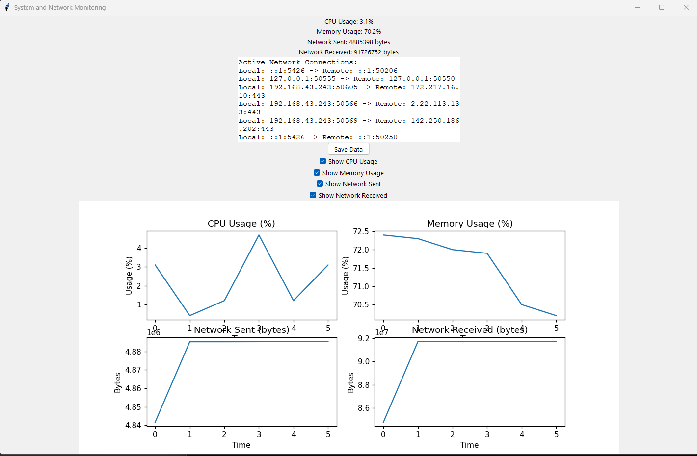

# BrowserGamesSpy v2
###### System and Network Monitoring Tool | [> Auf Deutsch lesen](LIES-MICH.md)



## Table of Contents
- [Introduction](#introduction)
- [Why This Tool?](#why-this-tool)
- [User Rights and GDPR](#user-rights-and-gdpr)
- [Features](#features)
- [New in Version 2](#new-in-version-2)
- [Requirements](#requirements)
- [Installation](#installation)
- [Usage](#usage)
- [Code Explanation](#code-explanation)
- [License](#license)
- [Source](#source)

## Introduction

This tool monitors system metrics and network connections for browser-based games like "The Settlers Online", "Forge of Empires", "Grepolis", "Travian: Legends", and "OGame". It collects data on CPU usage, memory usage, network activity, and active network connections, and displays these metrics in a graphical user interface (GUI) using `tkinter`. Additionally, the tool can save the collected data to a CSV file and visualize the metrics using `matplotlib`.


## Why This Tool?
Online game operators often claim their systems are secure and harmless to your system. However, many forensic experts and security admins can prove otherwise. Frequent blue screens or system freezes, leading to improper shutdowns, can cause the following damages to your system:

- **Data Loss**: Hard drive corruption
- **Memory Damage**: Permanent damage to RAM
- **Overheating**: Especially in modern devices like netbooks and laptops with minimal cooling and sensitive parts

It's not always clear where data is being sent, especially under the European General Data Protection Regulation (GDPR). As a user, I want to know where my data is being streamed. This tool is designed to help you document any concerns and potential damages, providing evidence to consumer protection agencies or similar entities to combat the pursuit of profit over service and security.

## User Rights and GDPR
Under the GDPR, users have several rights regarding their personal data:
- **Right to be Informed**: You must be informed about how your data is being used.
- **Right of Access**: You can access your personal data and understand how it is being processed.
- **Right to Rectification**: You can have your data corrected if it is inaccurate or incomplete.
- **Right to Erasure**: You can request your data to be deleted.
- **Right to Restrict Processing**: You can limit how your data is used.
- **Right to Data Portability**: You can obtain and reuse your data across different services.
- **Right to Object**: You can object to the processing of your data in certain circumstances.
- **Rights Related to Automated Decision-Making**: You can challenge and request a review of decisions made without human intervention.

This tool helps you exercise these rights by providing transparency about the data being collected and how it is being used.

## Features
- Monitors CPU usage, memory usage, network sent/received bytes, and active network connections.
- Displays metrics in a `tkinter` GUI with real-time updates.
- Allows the user to select which metrics to display using checkboxes.
- Saves collected data to a CSV file.
- Visualizes metrics in plots using `matplotlib`.

## New in Version 2
The most significant changes and new features in version 2 are:

1. **Detailed Logging System**:
   - Creates log files with timestamps.
   - Logs all major events and metrics.
   - Separate logs for each session.

2. **Enhanced Network Monitoring**:
   - Detects and logs new connections.
   - Saves connection history.
   - Optional IP localization (can be extended).

3. **Timestamps for All Events**:
   - Each metric is saved with precise timestamps.
   - Improved CSV files with time information.
   - Timestamps displayed in the GUI.

4. **Improved Error Handling**:
   - Try-catch blocks for critical operations.
   - Logs error messages for debugging.

The core functionality remains unchanged. Logs can be found in the `logs` folder, and saved metrics now include timestamps.

## Requirements
- Python 3.x
- `psutil` library for system metrics
- `selenium` library for browser interaction
- `tkinter` library for the GUI
- `csv` module for saving data
- `matplotlib` library for plotting data
- ChromeDriver for `selenium` (ensure it is in the PATH)

## Installation
1. Install the required libraries:
    ```bash
    pip install psutil selenium matplotlib
    ```

2. Download and install "ChromeDriver" and ensure it is in your PATH.

## Usage
1. Clone the repository or download the script.
2. Run the script:
    ```bash
    python monitor.py
    ```

3. The GUI will open and start monitoring the specified URL (https://www.diesiedleronline.de/). You can use this tool for every browser game, just change the URL to fit your needs.

4. Use the checkboxes to select which metrics to display in the plots.

5. Click the "Save Data" button to save the collected data to a CSV file.

## Code Explanation
The code consists of the following main parts:

1. **Imports and Functions**:
    - Import necessary libraries.
    - Define functions to get system metrics and network connections.

2. **Update Metrics**:
    - Collect metrics every 5 seconds.
    - Update the GUI with the latest metrics.
    - Append collected data to a list for future reference or saving.

3. **Save Data**:
    - Save the collected data to a CSV file when the "Save Data" button is clicked.

4. **Plot Data**:
    - Plot the selected metrics in the GUI using `matplotlib`.

5. **Main Function**:
    - Set up the `tkinter` GUI.
    - Start the Chrome browser using `selenium`.
    - Begin the monitoring and updating loop.

## License
This project is licensed under the GPLv3 License - see the [LICENSE](LICENSE) file for details.

## Source
- [BrowserGames-Spy](https://github.com/VolkanSah/BrowserGamesSpy)
### Misc

README.md created by Git Repo Manager (GPT) on [GPT-Store](https://chatgpt.com/g/g-HBNMrjPNU-git-repo-manager) by Volkan Sah

